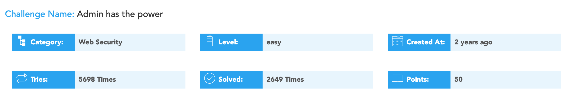
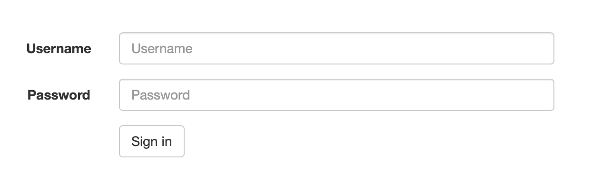
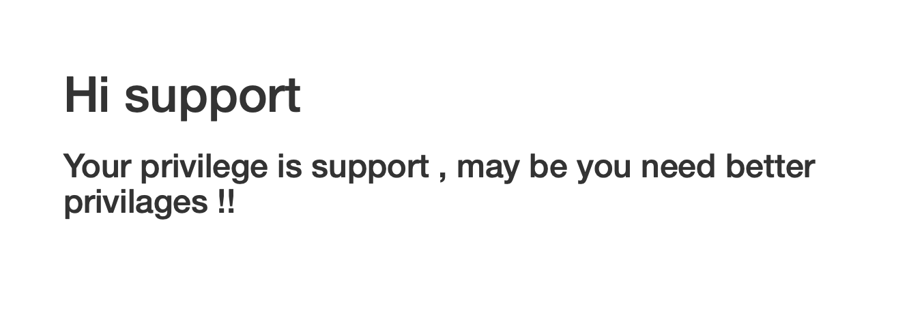
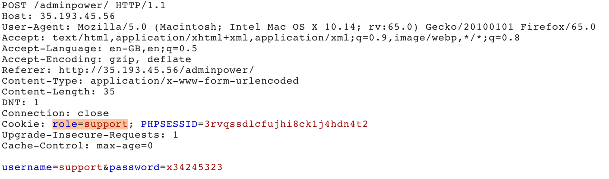
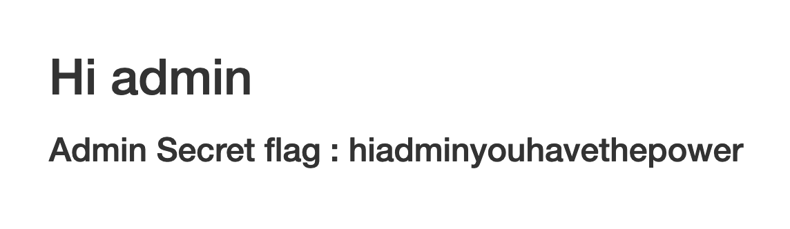

#Cyber-Talents: Web Security 
### [Admin has the power](https://cybertalents.com/challenges/web/admin-has-the-power)

> 


Website has simple [login portal](http://35.193.45.56/adminpower/).
>

First, inspect html source code. On line 18:
```
<!-- TODO: remove this line ,  for maintenance purpose use this info (user:support password:x34245323)-->
```

Using these credentials, we get the following:
>  

On Burp Suite, intercept and inspect POST.

In cookie, we find the field **role**.
> 

Edit the cookie in Burp Suite from support to admin, and forward.

We are then returned the following:
> 

We have discovered the secret flag: **hiadminyouhavethepower**


***************************************************************************

###Summary
This is an example of both Sensitive Data Exposure (OWASP A3:2017) and Broken Authentication (OWASP A2:2017) vulnerabilities.

### Description
Sensitive Data exposed in plaintext as comment

### Impact
Entire site vulnerable to compromise.

### Remediation
Sensitive Data Exposure  - Enforce better practice for comments. Ensure all code is clean and no sensitive data is available before publishing.

Broken Authentication - Multifactor authentication would preclude this vulnerability.