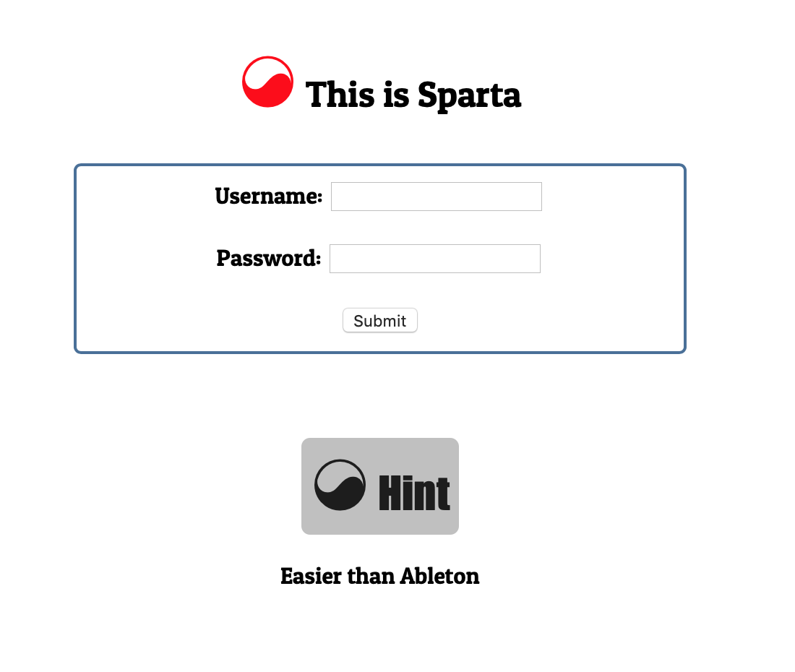
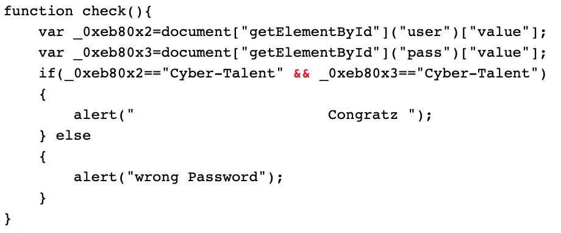

#Cyber-Talents: Web Security 
### [This Is Sparta](https://cybertalents.com/challenges/web/this-is-sparta)

> 

Website has simple [login portal](http://35.193.45.56/sparta/) with the hint 'Easier than Ableton'.
>

Once again, first step is to inspect the web page source code.

On line 34:
```
<script>
var _0xae5b=["\x76\x61\x6C\x75\x65","\x75\x73\x65\x72","\x67\x65\x74\x45\x6C\x65\x6D\x65\x6E\x74\x42\x79\x49\x64","\x70\x61\x73\x73","\x43\x79\x62\x65\x72\x2d\x54\x61\x6c\x65\x6e\x74","\x20\x20\x20\x20\x20\x20\x20\x20\x20\x20\x20\x20\x20\x20\x20\x20\x20\x20\x20\x20\x20\x20\x43\x6F\x6E\x67\x72\x61\x74\x7A\x20\x0A\x0A","\x77\x72\x6F\x6E\x67\x20\x50\x61\x73\x73\x77\x6F\x72\x64"];function check(){var _0xeb80x2=document[_0xae5b[2]](_0xae5b[1])[_0xae5b[0]];var _0xeb80x3=document[_0xae5b[2]](_0xae5b[3])[_0xae5b[0]];if(_0xeb80x2==_0xae5b[4]&&_0xeb80x3==_0xae5b[4]){alert(_0xae5b[5]);} else {alert(_0xae5b[6]);}}
</script>
```

After some cleaning, we can make more sense of it:
>

There appears to be a funciton with variables written in hex code.

Translate the contents of the variable _0xae5b from Hex to Text. We get the following:
>

Replace the variable calls in the function with these newfound text values. This makes the script funtion human readable.
>


This shows us that if the "user" and "pass" (password) values were both "Cyber-Talent", we should expect a congradulatory alert.

This is true, and we are rewarded with our flag: **{J4V4_Scr1Pt_1S_Aw3s0me}**

>

**Note**: Never understood the hint.